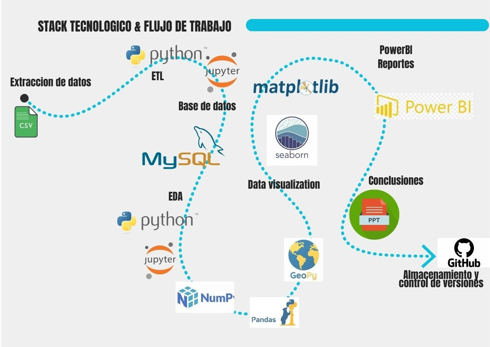
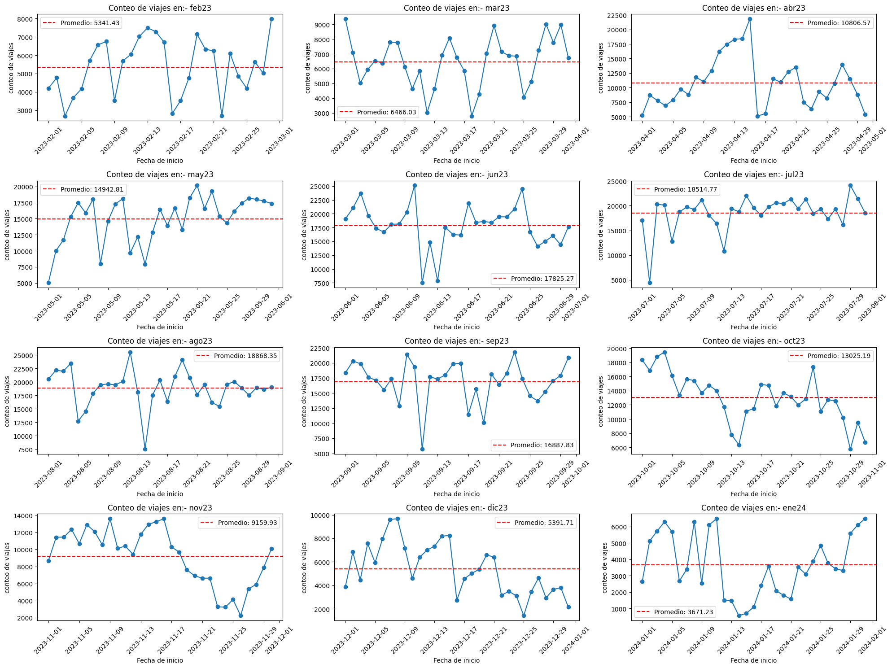
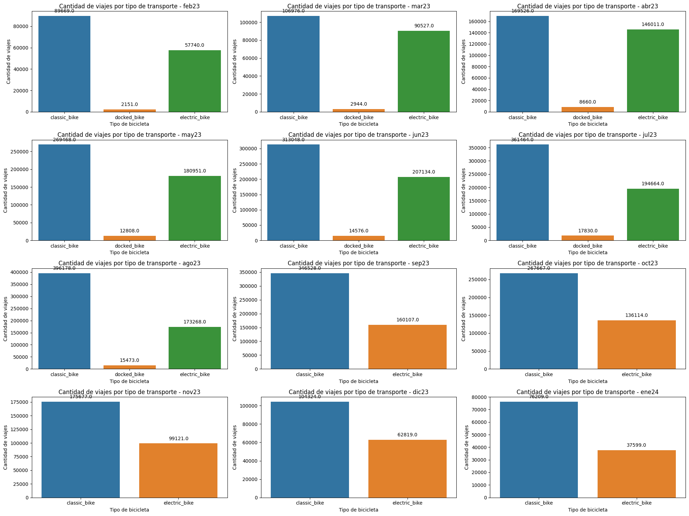
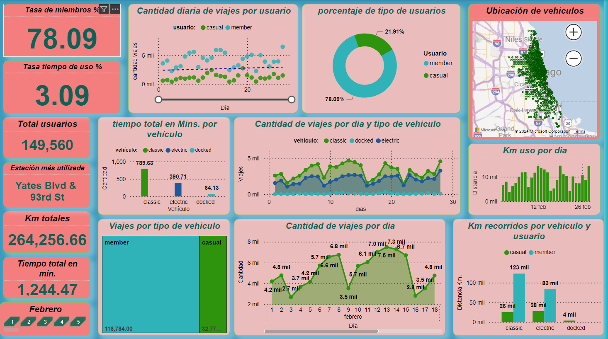
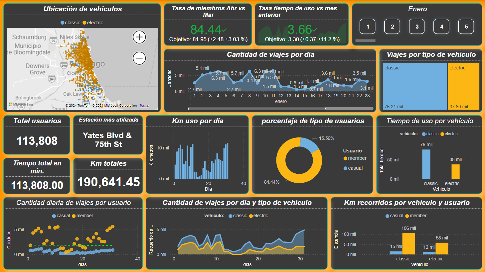
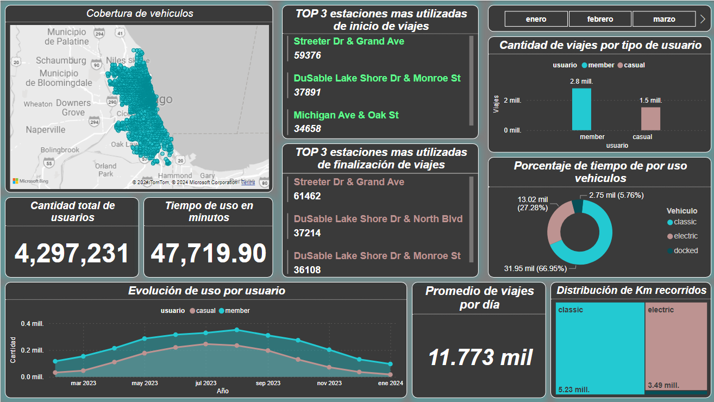
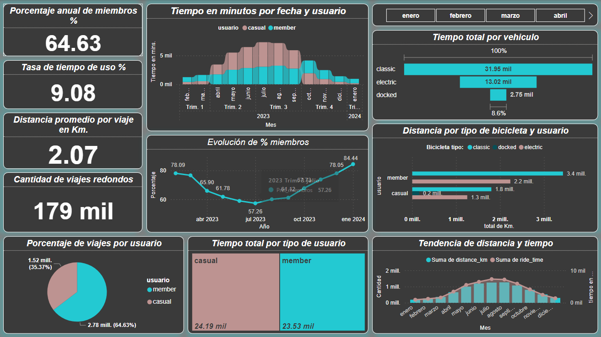
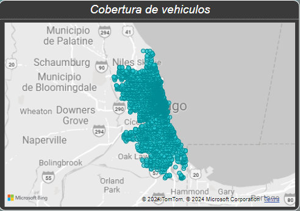

# <center>***Bikes_DA***</center>
# <center><u> ***DATA ANALYTICS*** </u></center>
---
## **CONTEXTO**
<div style="display: flex; flex-direction: row;">
     
     
</div> <br>
  
**La empresa "Cyclistic" realiza la renta de bicicletas mediantes una aplicacion movil, la renta se puede realizar por ocasion o adquiriendo una membresia.**
**La empresa busca analizar los datos recopilados de los usarios, buscando incrementar el porcentaje de usuarios que cuentan con una membresia desde febrero de 2023 hasta fin de enero 2024 .**

---
### **CONTENIDO**

[Datasets](https://github.com/JGIOVANNIE/Bikes_DA/tree/main/Datasets) : Dentro de la carpeta, se encuentran los datasets en crudo utilizados para este analisis, se eencuentran comprimidos en formato  ".zip".  

[Reportes](https://github.com/JGIOVANNIE/Bikes_DA/tree/main/Reportes) : Dentro de esta carpeta se encuentra el dasboard mensual donde se realiza un analisis descriptivo y se implementan algunos Kpi's. 

[notebooks](https://github.com/JGIOVANNIE/Bikes_DA/tree/main/notebooks) : Dentro de esta carpeta se encuentras los notebooks con extension ".ipynb" de jupyter en donde fue realizado el proceso de ETL enviando los datasets limpios a una base de datos en MySQL, tambien se encuentra el archivo EDA donde se realiza el primer analisis identificando factores importantes dentro de nuestros datos     

[src](https://github.com/JGIOVANNIE/Bikes_DA/tree/main/src) : En esta carpeta se encuentran las imagenes utilizadas para realizar este README.md

[Reporte anual](https://drive.google.com/drive/folders/1s7HPy4_i_I2Eav910bbh0Awa8aQTgoZK?usp=sharing) : En este enlace se encuentra el Dashboard con el analisís descriptivo total de los 12 meses. 

[Conclusiones](https://github.com/JGIOVANNIE/Bikes_DA/blob/main/Conclusiones.pptx) : Las conclusiones generales de el analisis se encuentran dentro de este archivo ".pptx" 

---
## ***STACK TECNOLOGICO*** 
   
<br>

---

<h2 style="text-align: center; font-weight: bold; font-style: italic;">PROCESO</h2>

### **ETL**
---
1. Se realizó la descarga de los datos de este [enlace](https://divvy-tripdata.s3.amazonaws.com/index.html) en la carpeta Datasets
2. los datos se cargaron en el archivo ETL iterando sobre la carpeta y asi poder conocer el resultado de todos los archivos simultaenamente :
``` 
# Ruta de la carpeta que contiene los archivos ZIP
ruta_carpeta = 'C:\\Users...\\Bikes_DA\\Datasets'

# Lista todos los archivos en la carpeta
archivos = os.listdir(ruta_carpeta)

# Filtra la lista para incluir solo los archivos ZIP
archivos_zip = [archivo for archivo in archivos if archivo.endswith('.zip')]

# Crea un diccionario para almacenar los DataFrames
dfs = {}

# Abre cada archivo ZIP y lee su contenido
for archivo_zip in archivos_zip:
    with zipfile.ZipFile(os.path.join(ruta_carpeta, archivo_zip), 'r') as zip_ref:
        # Abre cada archivo de texto dentro del ZIP
        for nombre_archivo in zip_ref.namelist():
            # Ignora los archivos que comienzan con '__MACOSX/'
            if not nombre_archivo.startswith('__MACOSX/'):
                with zip_ref.open(nombre_archivo) as archivo:
                    # Lee el archivo y lo convierte a un DataFrame
                    df = pd.read_csv(archivo)
                    # Almacena el DataFrame en el diccionario
                    dfs[nombre_archivo] = df  
```
3. iterando dentro de cada Dataframe se buscaron  datos nulos, duplicados, alguna anomalía
4. Se calcuaron las columas ride_time y distance_km(mediante la biblioteca geopy) calculando la distancia entre las coordenadas de incio y fin de los 
viajes 

```
from geopy.distance import geodesic

# Define una función para calcular la distancia
def calcular_distancia(df):
    # Crea una nueva columna con la distancia en km
    df['distance_km'] = df.apply(lambda row: geodesic((row['start_lat'], row['start_lng']), (row['end_lat'], row['end_lng'])).km, axis=1)
    
    return df  
```
5. Para finalizar el ETL se cargaron los Dataframes a *MySQL* creando una base de datos para almacenar los datasets limpios
---                       
### EDA

1. Se cargaron  los Datasets desde la base de datos creada "Bikes_bd" 
2. Se itero sobre la base de datos para obtener los datos estadisticos de cada una de las tablas.
4. Se cambio el tipo de dato de algunas columnas para poder realizar una mejor comprensión de los datos
5. Se realizaron graficos son las librerias *"matplotlib"* y *"Seaborn"*
6. Se realizaron conclusiones sobre cada grafico obtenido 

<div style="display: flex; flex-direction: row;">
     
    
</div><br>

---
### **REPORTES**

#### <u>***REPORTES MENSUALES*** </u>
1. Se cargaron los datos desde el conector con *MySQL* en *PowerBI* 
2. Se realizo la transformación de datos correspondiente: para los reportes mensuales se eliminaron algunas columnas que no eran necesarias, se reviso el tipo de dato y realizó las correciones correspondientes. 
3. se realizaron los graficos correspondientes y las medidas necesarias para los kpi´s 

```
TASA DE TIEMPO DE USO = 
TOTAL TIEMPO USO / TOTAL TIEMPO DISPONIBLE * 100
````
````
TASA DE MIEBROS = 
TOTAL MIEMBROS / TOTAL USUARIOS * 100 
````
4. Para evaluar los resultados de manera mensual se buscaba incrementar el porcentaje de miembros en un 5% y la tasa de tiempo de uso en un 5%
<br>
Para realizar las medidas se utilizo la siguiente formula 

````
OBJETIVO TIEMPO DE USO =
Tasa_de_tiempo_de_uso_mes_anterior * 1.05
````
````
OBJETIVO PORCENTAJE DE MIEMBROS =
Tasa_de_miebros_mes_anterior * 1.05
````


#### <u>***REPORTE ANUAL*** </u>
1. Se cargaron los datos desde el conector con *MySQL* en *PowerBI*
2. Concatene las tablas anexando las consultas en *PowerQuery*  
3. Se realizaron las transformaciones necesarias y los graficos pertinentes para el analisís
4. se realizaron las medidas adecuadas para evaluar los resultados de los 12 meses 

<br>
<div style="display: flex; flex-direction: row;">
     
     
</div>
<div style="display: flex; flex-direction: row;"> 
    
    
</div><br>

---

### **CONCLUSIONES** 

1. Se analizaron los graficos y se determinaron algunas conclusiones y se realizo la presentación en un archivo *.pptx* 
2. dentro de las cuales destacamos que en temporadas con mayor afluencia los usarios que ya tienen una membresia disminuyen y los usuarios casuales aumentan, siendo esto posible por periodos vacionales o mejores condiciones climaticas 
3. las estaciones más utilizadas son las que se encuentran en zonas turisticas dando
4. tenemeos una amplia cobertura en la ciudad de **CHICAGO** hablando sobre la cantidad de estaciones de servicio 



---

| AUTOR | LINKEDIN | CORREO |
|-------|----------|--------|
| JOSHUA GIOVANNI ESQUIVEL FUENTES |[jgiovannie](www.linkedin.com/in/jgiovannie) | jg.esquivel@outlook.com |
---

